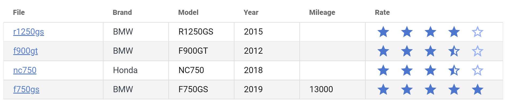

## Obsidian Database Plugin

Do you like Dataview plugin for Obsidian? This one is taking Dataview to next level, but not only allowing you to view the data, but also... edit it in place!

## Features

- allows you to generate a table based on files in a directory
- the table is editable, if you edit a cell the changes will be written to original file!
- supports multiple types of data, including rating with stars and progress bars
- supports sorting by multiple columns (including dynamic sorting by clicking on column header)
- supports creating links between documents (the real ones, shown on graph)
- you can create templates with a subset of fields and include them in multiple files

## Example

Let's create a database of motorcycles offers you consider buying.

1. create directory called `motorcycles`
2. create a file with a table:

```
```databaseTable
sources:
- type: directory
  path: motorcycles
fields:
- name: file
  type: fileName
  label: File
  width: 20%
- name: brand
  label: Brand
  type: link
  sources:
  - type: directory
    path: brands
- name: model # field name in frontmatter
  label: Model # display label
- name: year
  label: Year
- name: mileage
  label: Mileage
- name: accessories
  label: Accessories
  type: dropdown
  multiple: true
  options:
  - label: Crash bars
    value: crash-bars
  - label: Bags
    value: bags
  - label: Cruise control
    value: cruise-control
  - name: rate
    label: Rate
    type: rating
    width: 10%
  - name: owned
    label: Owned
    type: checkbox
\```
```
(replace final line with triple ` )

3. now, create some files inside directory `motorcycles` (and if you want autosuggest for `Brand` field then create some files in `brands` folder), they can be blank or you can put some sample frontmatter matching `name` in the list above
4. after you go back to a file with a table, you should see entries for newly created files
5. you can put data in the table now and they will be filled inside the files!



## Sources

There are the following sources available:
### directory

Reads all files from specified directory.

Example usage:

```
sources:
- type: directory
  path: motorcycles
```

### tags

Reads all files with one of the tags specified.

Example usage:

```
sources:
- type: tags
  tags:
  - motorcycles
```

### related

Reads all files that refer to current file, optionally with one of the tags specified.

Example usage:

```
sources:
- type: related
  tags:
  - motorcycles
```

## Field types

The plugin, at the moment, supports the following field types:

### fileName

Generates clickable link with filename.
### filePath

Generates clickable link with full file path (relative to vault root).

### link

This type generates a block with links in the target documents, you can add `multiple: true` to link to multiple documents.

To enable autocomplete you need to add `source` parameter:

```
- name: brand
  label: Brand
  type: link
  sources:
  - type: directory
    path: brands
```

This way the plugin searches `brands` directory and suggest linking to any file within that directory.

### rating

Shows 5 stars control for providing a rating.

### progress

Shows a slider that you can use to set the progress  (0-100%).

### checkbox

Simple checkbox with true/false values

### dropdown

Generates a dropdown with selectable values. You can use it to select predefined value or values from list:

Multiple values example:

```
- name: accessories
  label: Accessories
  type: dropdown
  multiple: true
  options:
  - label: Crash bars
    value: crash-bars
  - label: Bags
    value: bags
  - label: Cruise control
    value: cruise-control
```

Single value example (with colors):

```
- name: status
  label: Status
  type: dropdown
  width: 10%
  options:
  - label: In progress
    value: inProgress
    color: green
  - label: Next up
    value: nextUp
    color: gray
    dark: true
```

By default, the font color will be determined automatically, but if you want to adjust it to be white, then mark the item with `dark: true` to indicate that a provided color is dark.

### Other types

`number`, `text`, `date` and other supported by HTML input field (when field type is not any of above, it fallbacks to standard input field with type specified)

## Templates and including other files

If you need to use some of the settings in multiple files you can move that common settings to separate file (in frontmatter section) and then use `include` to read that file:

```
include: "database-templates/motorcycles.md"
```

You can also include multiple files:

```
include:
- "database-templates/a.md"
- "database-templates/b.md"
```

If you have both `include` statement as well as inline parameters, the merging process happens first by evaluating list of `include` and then inline parameters, so they take precedence over `include` - this way you can override some settings, if needed.

## settings

### Global ignore filter

This setting allow you to set a list of regexpes that will be applied to all your tables.

It's especially useful e.g. if you're using Folder Note plugin which generates `index.md` file in the folder.

## Known issues

- doesn't support inline adding of new files/records yet
- doesn't support dark mode
- uses ugly CSS to show context menus

## Future plan
- add filtering
- add grouping
- add sorting in both directions in the code
- add ability to use Dataview queries as a source

## Use plugins and other projects

This plugin is powered by [Vue](https://github.com/vuejs/vue) and [Vuetify](https://github.com/vuetifyjs/vuetify)!